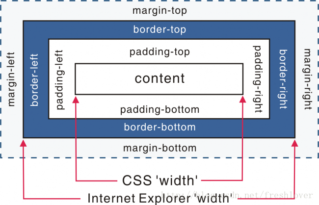

# 认识html

## HTML 标签

- HTML 指的是超文本标记语言 (Hyper Text Markup Language)
- HTML 不是一种编程语言，而是一种标记语言 (markup language)
- 标记语言是一套标记标签 (markup tag)
- HTML 使用标记标签来描述网页

## HTML 文档 = 网页

- HTML 文档描述网页
- HTML 文档包含 HTML 标签和纯文本
- HTML 文档也被称为网页

## html 文档格式(DOCTYPE！)

- 盒模型的高宽包含内边距padding和边框border
  如图，
  ###
    
  ###
  在W3C标准中，如果设置一个元素的宽度和高度，指的是元素内容的宽度和高度，而在IE5.5及以下的浏览器及其他版本的Quirks模式下，  个宽度和高度还包含了padding和border

- 可以设置行内元素的高宽
  在Standards模式下，给span等行内元素设置width和height都没有效果，但是在Quirks模式下，会生效
- 可设置百分比的宽度
  在Standards模式下，一个元素的高度是由它包含的内容来决定的，如果父元素没有设置高度，子元素设置一个百分比的高度是无效的。
- margin:0 auto设置水平居中在IE下会失效
  用margin:0 auto在Standards模式下可以使元素水平居中，但在Quirks模式下却会使小，Quirks模式下的解决办法是用text-align。
- Quirks模式下设置图片的padding会失效
- Quirks模式Table的自提属性不能继承上层的设置
- Quirks模式white-space:pre会失效